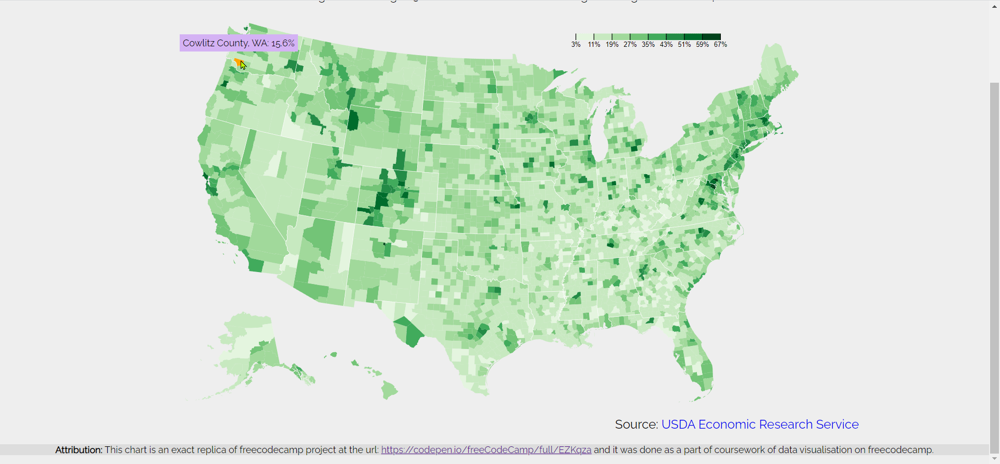

# D3 choropleth map - Unites States Educational Attainment

This map shows the percentage of adults over 25 with a bachelor's degree or higher in different counties in USA.
This map was constructed using Topojson.js and d3.js libraries.

When you hover over a county, you will get more information via tooltip that appears.

You can use your own data by changing the urls in d3.json method. You can change the colors by changing the colors array in the script.js file. Different sequential palettes were generated in color brewer and added for convenience in the file for convenience.

Chec out the deployed app at [https://prismatic-flan-40db31.netlify.app/](https://prismatic-flan-40db31.netlify.app/).
**Attribution**: This chart is an exact replica of freecodecamp project at the url: [https://codepen.io/freeCodeCamp/full/EZKqza](https://codepen.io/freeCodeCamp/full/EZKqza ) and it was done as a part of coursework of data visualisation  course on freecodecamp.

A Pen created on CodePen.io. Original URL: [https://codepen.io/sathishkannan/pen/LYmdqPX](https://codepen.io/sathishkannan/pen/LYmdqPX).
